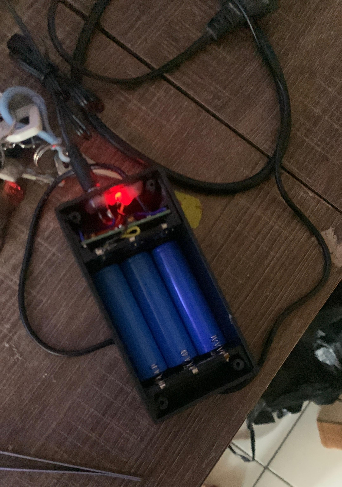
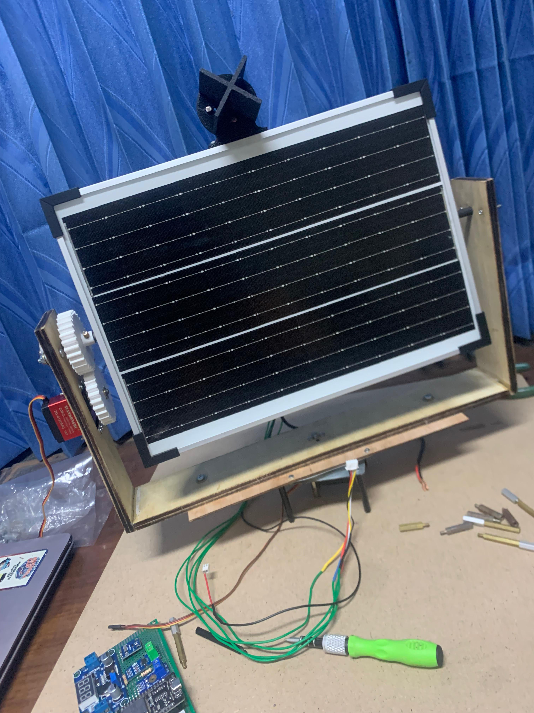
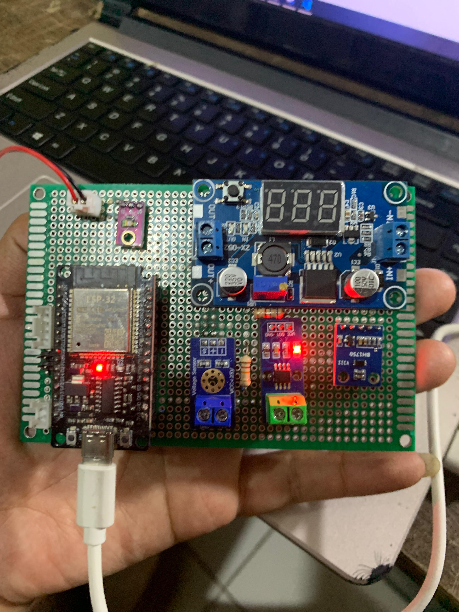

## Logbook Kelompok 2

Mata kuliah: Capstone Design

Semester: Gasal 2025/2026

Anggota

1. Ramania Nur Alifa: @ramaniaalifa11
2. Nabil Emillul Fata: @Nabileft
3. Billy Hermawan: @billyhermawan998

### 27 Februari 2026

#### Yang sudah dilakukan

- Menyusun konsep proyek
- Membuat desain 3D
- Menyusun laporan DCP 100
- Menyusun PPT DCP 100

#### Masalah yang dihadapi

- Masih terdapat kesalahan pada format penulisan dokumen 

#### Yang akan dilakukan

- [ ] Memaparkan PPT DCP 100, PIC: @ramaniaalifa11, @Nabileft, @billyhermawan998
- [ ] Memperbaiki format dan isi laporan DCP 100, PIC: @ramaniaalifa11, @Nabileft
- [ ] Memperbaiki gambar pada laporan DCP 100, PIC: @billyhermawan998, @Nabileft

#### Catatan

- Perlu baca kembali dokumen perancangan

### 16 Maret 2026

#### Yang sudah dilakukan

- Menyusun laporan DCP 200
- Menyusun PPT DCP 200
  
#### Masalah yang dihadapi

- Kesalahan pada beberapa bagian isi laporan

#### Yang akan dilakukan

- [ ] Memaparkan PPT DCP 200, PIC: @ramaniaalifa11, @Nabileft, @billyhermawan998
- [ ] Memperbaiki penulisan laporan DCP 200, PIC: @ramaniaalifa11, @Nabileft, @billyhermawan998

#### Catatan

- Lebih teliti dalam penyusunan laporan

### 4 April 2026

#### Yang sudah dilakukan

- Menyusun laporan DCP 300
- Menyusun PPT DCP 300
- Mencari toko pembelian komponen
- Membuat desain tambahan untuk tempat sensor LDR

#### Masalah yang dihadapi

- Memperbaiki kesalahan penulisan pada laporan

#### Yang akan dilakukan

- [ ] Memesan kebutuhan mekanik di toko CNC, PIC: @billyhermawan998
- [ ] Memesan kebutuhan elektronik, PIC: @ramaniaalifa11, @billyhermawan998
- [ ] Mencetak gear dan dudukan LDR menggunakan 3D printer, PIC: @Nabileft

#### Catatan

- Menggabungkan laporan DCP 100- DCP 300

### 6 Mei 2026

#### Yang sudah dilakukan

- Merangkai bagian mekanikal
- Membuat Baterai 3S Pararel Li ion 18650 1800mAh dengan modul mini UPS 12V sebagai BMS sederhana dan Boost Converter dari 3,7V ke 12V

#### Masalah yang dihadapi

- Beberapa komponen tidak presisi

#### Yang akan dilakukan

- [ ] Melanjutkan assembly, PIC: @Nabileft, @ramaniaalifa11, @billyhermawan998
- [ ] Menyusun rangkaian elektronik, PIC:@billyhermawan998, @ramaniaalifa11, @Nabileft 

#### Catatan

- Melengkapi komponen yang kurang

### 8 Mei 2026

#### Yang sudah dilakukan

- Pemasangan panel surya pada tube tracker
- Menyolder komponen elektronik

#### Masalah yang dihadapi

- Pengunci panel surya masih belum sesuai ukurannya

#### Yang akan dilakukan

- [ ] Menyelesaikan rangkaian elektronik, PIC: @billyhermawan998
- [ ] Menyelesaikan bagian mekanikal panel surya, PIC: @Nabileft
- [ ] Membuat program pada Arduino IDE dan dashboard monitoring, PIC: @ramaniaalifa11

#### Catatan

- Proses percobaan dashboard baru bisa dilakukan setelah rangkaian elektronik selesai

### 18 Mei 2026

#### Yang sudah dilakukan

- Menyelesaikan masalah mekanikal kemarin yaitu pengunci panel surya
- Melanjutkan menyolder komponen elektronik
- Mencoba membuat dashboard

#### Yang akan dilakukan

- [ ] Melanjutkan mekanikal axis bagian bawah, PIC: @Nabileft
- [ ] Menyelesaikan bagian elektronik agar bisa di test, PIC: @billyhermawan998
- [ ] Melanjutkan mencoba mendesain dashboard, PIC: @ramaniaalifa11

#### Catatan

- tidak ada

### 22 Mei 2026

#### Yang sudah dilakukan

- Menyelesaikan rangkaian PCB secara keseluruhan
- Melakukan unit testing dan kalibrasi seluruh sensor
- Pemasangan aktuator servo di yaw dan pitch dan menyempurnakan sistem gerak trackingnya

#### Yang akan dilakukan

- [ ] Mencari alternatif lain dari sensor BH1750 Lux, PIC: @billyhermawan998

#### Catatan

- Pada sensor BH1750 tidak tertampil, terdapat asumsi pin i2c esp32 rusak karena beli bekas atau sensor BH1750 yang rusak

### 25 Mei 2026

#### Yang sudah dilakukan

- Menyelesaikan manufakturing keseluruhan mekanis, mulai dari pergerakan X maupun Y

#### Yang akan dilakukan

- [ ] maintenance sisi mekanis,  PIC:@billyhermawan998, @ramaniaalifa11, @Nabileft 

#### Catatan

- tidak ada

### 28 Mei 2026

#### Yang sudah dilakukan

- Mengganti sensor BH1750 menjadi TEMT6000 
- Melaukan unit testing pada TEMT6000
- Menyempurnakan PCB

#### Yang akan dilakukan

- [ ] Mencari pembanding untuk kalibrasi pada sensor lux meter TEMT6000, PIC: @billyhermawan998

## Catatan
- Sensor TEMT6000 masih belum tau akurasinya karena tidak ada alat ukur besaran lux meter

### 3 Juni 2026

#### Yang sudah dilakukan

- Fiksasi mapping PCB, SCC dan baterai pada papan PLTS
- Update program ESP32 pada arduino IDE
- Update JSON flow pada node-red untuk tampilan dashboard
- Revisi DCP 100-400
- Menyusun DCP 500
- Merapikan kabel wiring

#### Masalah yang dihadapi

- Dashboard belum bisa digunakan karena masih ada penambahan sensor

#### Yang akan dilakukan

-[ ] Menambahkan sensor arus ACS712, PIC: @billyhermawan998
-[ ] Menambahkan MCB, PIC: @billyhermawan998
-[ ] Finalisasi program ESP32 dan dashboard, PIC: @ramaniaalifa11
-[ ] Membuat pamflet produk, PIC: @Nabileft
